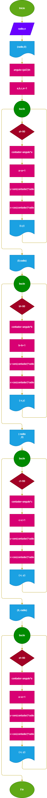

# coordenadas_circulo_radioX
Programa que permite obtener las coordenadas de una circunferencia a partir del radio, usando seno y coseno.
Usted decidira que tan precisa sean las coordenadas al digitar el número que dividira el segmento del primer cuadrante  
## Diseño
### diagrama de flujo 

